# Construction of Perfect Arrays

**Definition:** 
A perfect array $PA(n,d,\mathbf{a},\mathbf{b})$  is a $d$-dimensional periodic $n$-ary array of size $b_1 \times b_2 \times \ldots \times b_d$ that contains every possible $a_1 \times a_2 \times \ldots \times a_d$ $n$-ary array exactly once as a subarray.

## One-dimensional perfect array: perfect sequence ## 
A periodic n-ary (n ≥ 2) sequence containing each possible k-tuple (“pattern”) (k ≥ 1) of the elements $X = \{0,1,\ldots,n-1\}$ as a contiguous subsequence exactly once is called a perfect sequence (also known as a de Bruijn sequence).

$PS(n,k) \equiv PA(n, 1, k, n^k)$


**Examples**  
Perfect sequence (2, 2): 0011  
Perfect sequence (2, 3): 00010111  
Perfect sequence (3, 2): 002212011  

Note that each of the $n^k$ possible k-tuple appears exactly once in these sequences.

Perfect sequence can be generated using the Python script `PerfectSequence.py`

### Python code
```Python
from PerfectSequence import PerfectSequence

ps = PerfectSequence(2, 2)
print("Perfect sequence:",ps)
print("All patterns in perfect sequence:")
for pattern in ps:
    print(pattern)
```
### Output
```text
Perfect sequence: 0011
All patterns in perfect sequence:
[0, 0]
[0, 1]
[1, 1]
[1, 0]
```

## Artistic presentations of some perfect sequences ## 

<p align="center">
  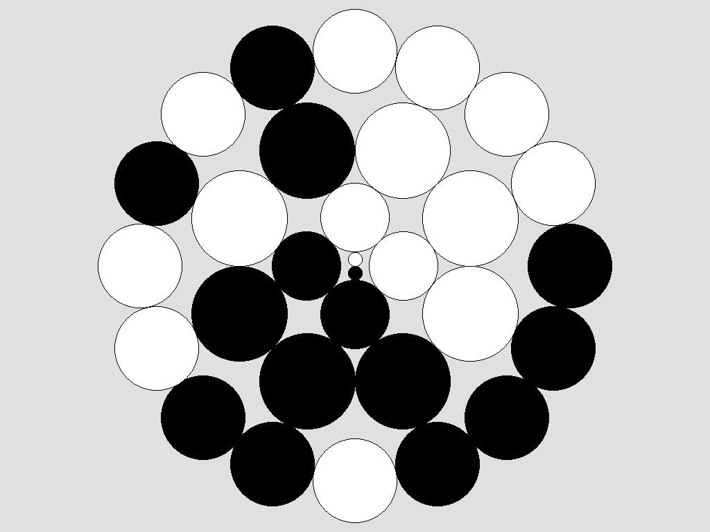
  <br/>
  <em>Perfect sequences (length of alphabet = 2, length of pattern = 1,2,3,4)</em>
</p>

<p align="center">
  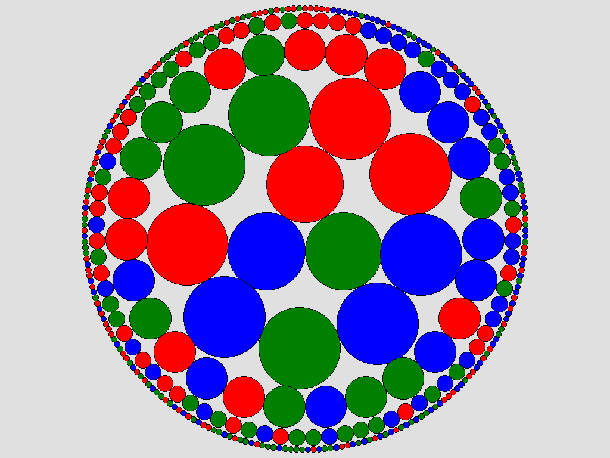
  <br/>
  <em>Perfect sequences (length of alphabet = 3, length of pattern = 1,2,3,4,5)</em>
</p>

Pictures were generated using the Python script `ArtisticDisplayOfPerfectSeqs.py`

## Super perfect sequence ##
An infinite $n$-ary sequence whose periodic prefixes are perfect sequences is called an $n$-superperfect sequence.

$SPS(n)  \equiv  PA(n, 1, \infty)$ 

**Examples:**  
Super perfect sequence (2):  
01...  
**01**10...  
**0110**010100001111...  
**0110010100001111**0110010011101111011001...  

Super perfect sequence (3):  
012...  
**012**001110100022212202112102...  

Super perfect sequence (6):  
012345...  
**012345**01233501232501231501230501224501...  

Super perfect sequence can be generated using the Python script `SuperPerfectSequence.py`

### Python code
```Python
from SuperPerfectSequence import SuperPerfectSequence

sps = SuperPerfectSequence(3, 2)
print("SuperPerfectSequence:",sps)
```
### Output
```text
SuperPerfectSequence: 012001110100022212202112102
```

## Artistic presentations of super perfect sequences ## 
<p align="center">
  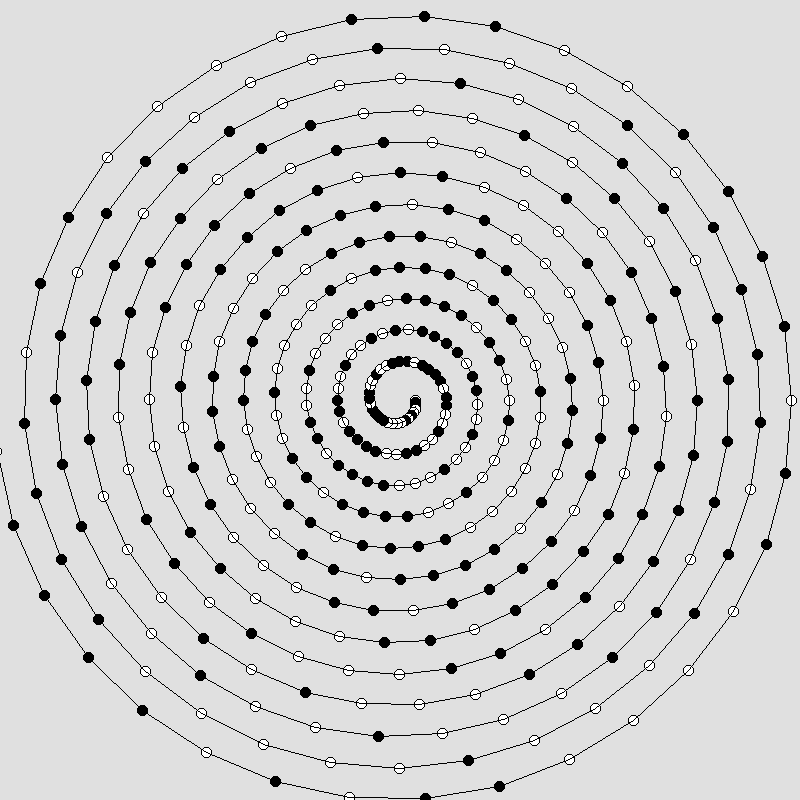
  <br/>
  <em>Super perfect sequence (2) in spiral</em>
</p>

<p align="center">
  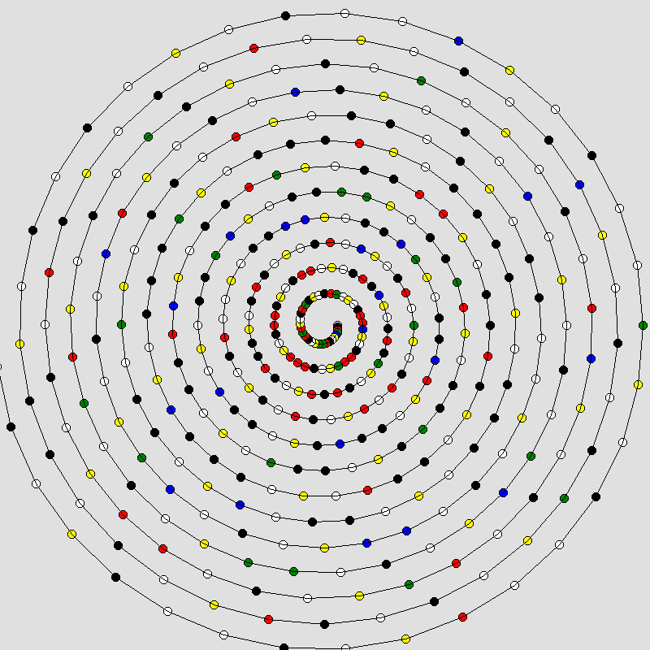
  <br/>
  <em>Super perfect sequence (4) in spiral</em>
</p>

<p align="center">
  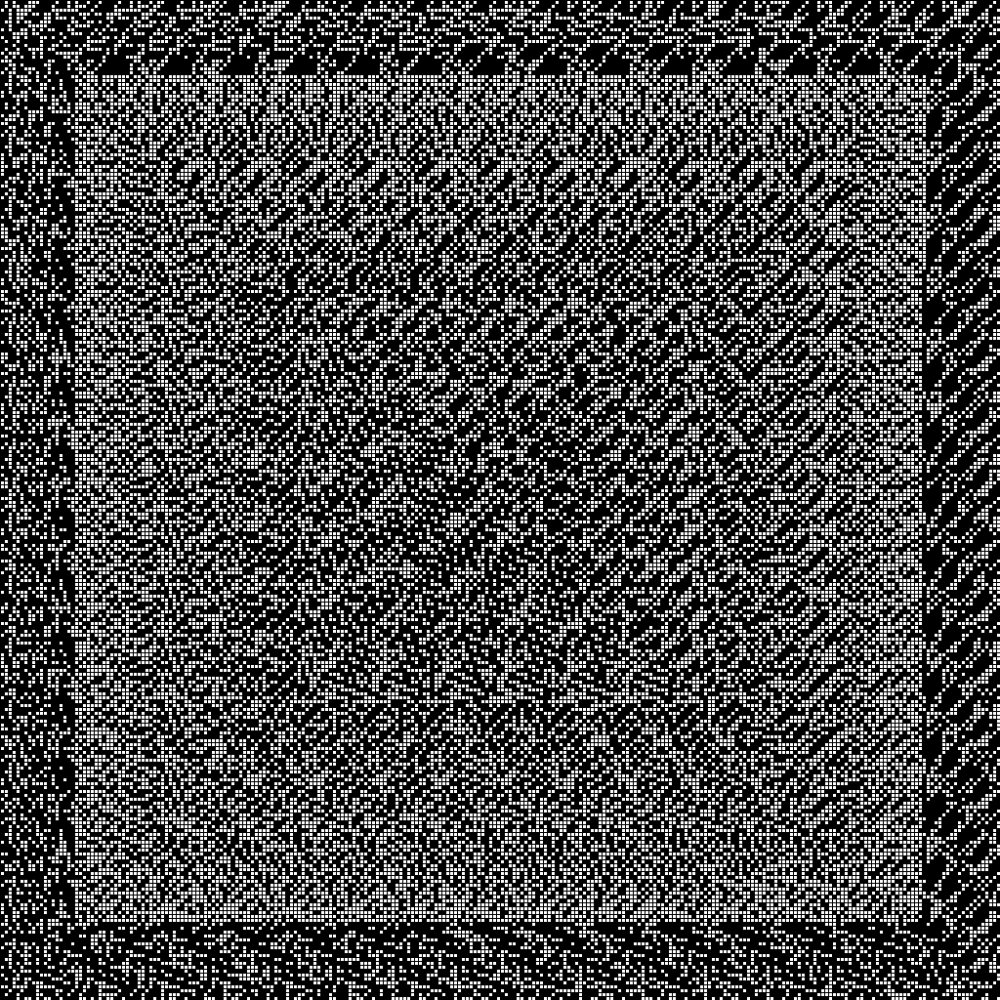
  <br/>
  <em>Super perfect sequence (2) in square</em>
</p>

<p align="center">
  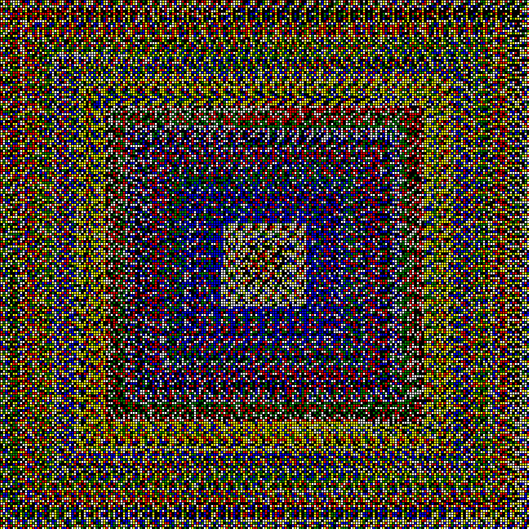
  <br/>
  <em>Super perfect sequence (6) in square</em>
</p>

Pictures were generated using the Python script `ArtisticDisplayOfSuperPerfectSeqs.py`

## Two-dimensional perfect array: perfect map ## 
A periodic $n$-ary $A \times B$ matrix is called $(n,a,b,A,B)$ perfect map if it contains every $n$-ary $a \times b$ matrix as a submatrix exactly once. (n ≥ 2, a ≥ 2, b ≥ 2)  
Its shape is a toroidal matrix.

$PM(n,a,b,A,B)   \equiv  PA(n, 2, a \times b, A \times B)$  

**Examples:**  
Perfect map (length of alphabet = 2, number of submatrix rows = 2, number of submatrix columns = 2):  

$$
PM(2,2,2,4,4)=
\begin{bmatrix}
0 & 0 & 0 & 1 \\
0 & 0 & 1 & 0 \\
1 & 0 & 1 & 1 \\
0 & 1 & 1 & 1 \\
\end{bmatrix}
$$

Perfect map (length of alphabet = 3, number of submatrix rows = 2, number of submatrix columns = 2):  
<p align="center">
  
</p>

Note that each of the n^(a*b) possible $a \times b$ subarrays ($a$ rows, $b$ columns) appears exactly once in these $A \times B$ periodic arrays.

Perfect maps can be generated using the Python script `PerfectMap.py`

### Python code
```Python
from PerfectMap import PerfectMap

pm = PerfectMap(2, 2, 2)
print("PerfectMap:")
print(pm)
print()

print("All subarrays in the perfect map:")
number = 0
for subarray in pm:
    number +=1 
    print(f"{number:2d}. {subarray}")
```
### Output
```text
PerfectMap:
0001
0010
1011
0111

All subarrays in the perfect map:
 1. [[0, 0], [0, 0]]
 2. [[0, 0], [0, 1]]
 3. [[0, 1], [1, 0]]
 4. [[1, 0], [0, 0]]
 5. [[0, 0], [1, 0]]
 6. [[0, 1], [0, 1]]
 7. [[1, 0], [1, 1]]
 8. [[0, 0], [1, 1]]
 9. [[1, 0], [0, 1]]
10. [[0, 1], [1, 1]]
11. [[1, 1], [1, 1]]
12. [[1, 1], [1, 0]]
13. [[0, 1], [0, 0]]
14. [[1, 1], [0, 0]]
15. [[1, 1], [0, 1]]
16. [[1, 0], [1, 0]]
```

## 2D illustrations of some perfect maps ## 
<p align="center">
  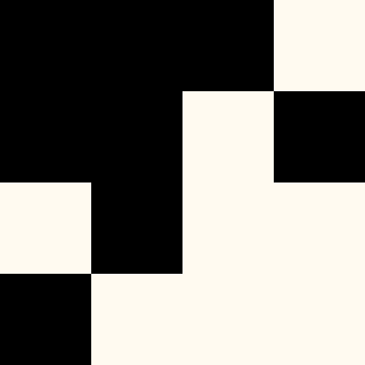
  <br/>
  <em>Perfect map (2,2,2,4,4)</em>
</p>

<p align="center">
  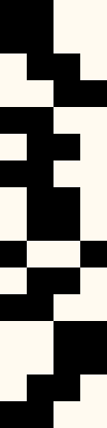
  <br/>
  <em>Perfect map (2,3,2,16,4)</em>
</p>

<p align="center">
  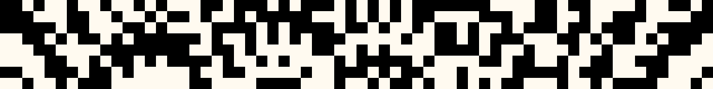
  <br/>
  <em>Perfect map (2,3,3,8,64)</em>
</p>

<p align="center">
  
  <br/>
  <em>Perfect map (3,2,2,9,9)</em>
</p>

<p align="center">
  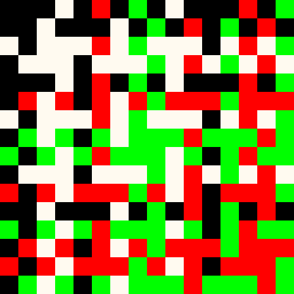
  <br/>
  <em>Perfect map (4,2,2,16,16)</em>
</p>

<p align="center">
  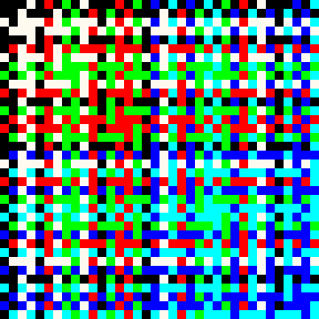
  <br/>
  <em>Perfect map (6,2,2,36,36)</em>
</p>

## 3D illustrations of some perfect maps ## 

* [Perfect map (2,2,2,4,4)](3D/PM_2_2x2_4x4.html) 
* [Perfect map (2,3,2,4,16)](3D/PM_2_3x2_16x4.html)
* [Perfect map (2,2,3,8,8)](3D/PM_2_2x3_8x8.html)
* [Perfect map (2,3,3,16,32)](3D/PM_2_3x3_16x32.html)
* [Perfect map (3,2,2,9,9)](3D/PM_3_2x2_9x9.html)
* [Perfect map (4,2,2,16,16)](3D/PM_4_2x2_16x16.html)
* [Perfect map (6,2,2,36,36)](3D/PM_6_2x2_36x36.html)

## Requirements
* Python 3.14+
* [Pillow](https://pypi.org/project/Pillow/)

## References
[1] A. Iványi, Construction of three-dimensional perfect matrices, Ars Combin., 29C (1990), 33–40  
[2] Horváth Márk, Iványi Antal: Growing perfect cubes DISCRETE MATHEMATICS 308: (19) pp. 4378-4388.  

## Dedication
In memory of Professor Antal Iványi.
